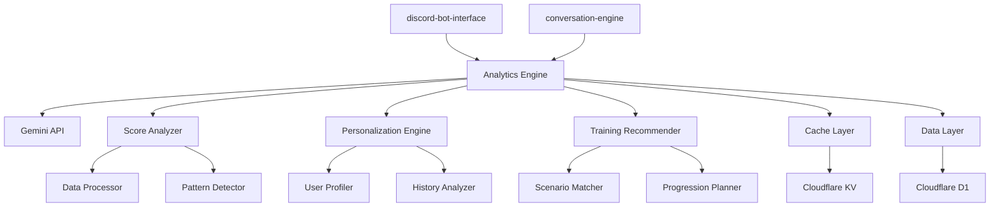
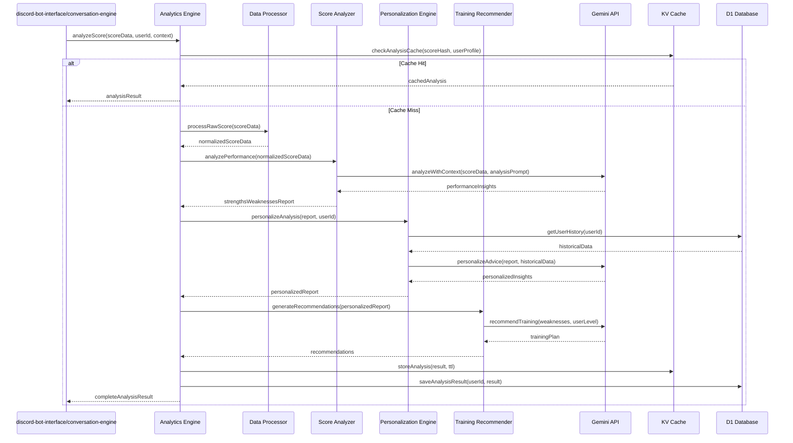
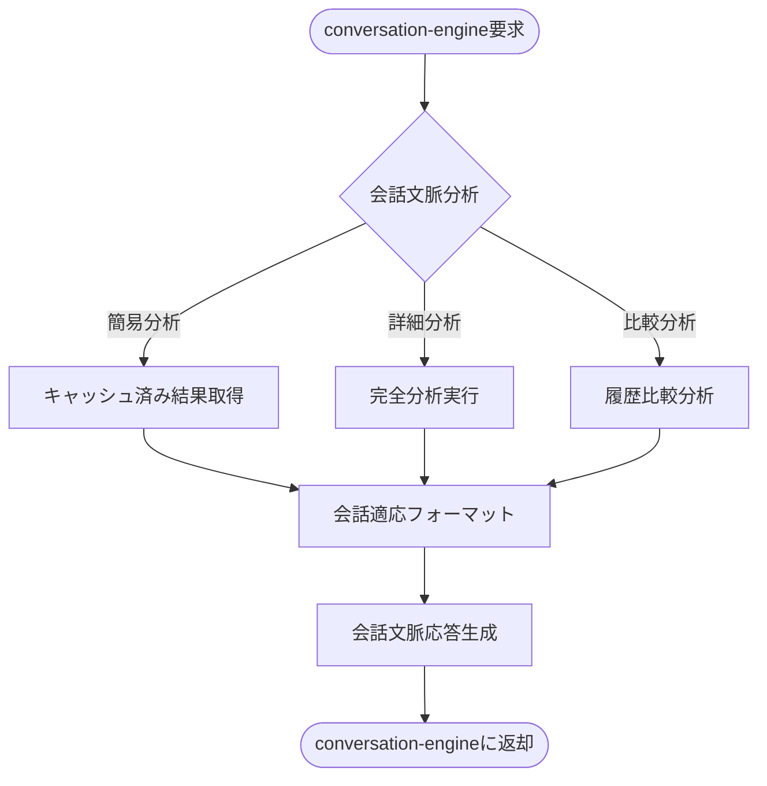
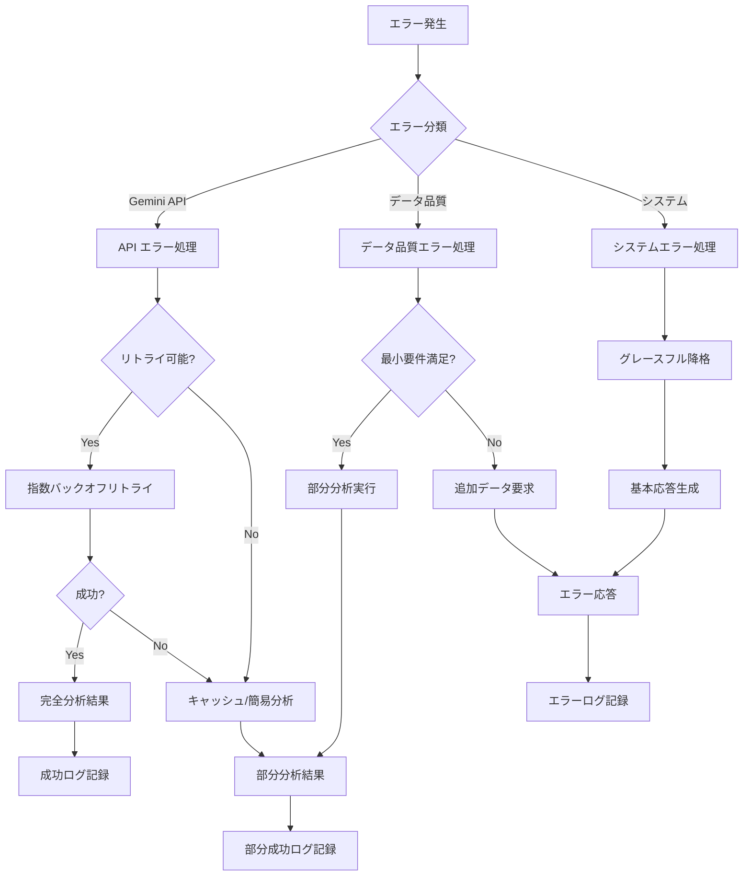

# 設計文書

## 概要

Analytics Engineは、FPSプレイヤーのエイムトレーニングスコアを分析し、パーソナライズされたアドバイスとトレーニング推奨を提供するCloudflare Workers上のマイクロサービスです。Gemini APIの高度な分析能力を活用し、AimLabやKovaaaksから収集されたスコアデータを深く理解して、各ユーザーの技術レベルと成長パターンに応じた具体的な指導を生成します。

**目的**: Discord Bot経由でFPSプレイヤーに専門的なエイム分析とパーソナライズされたコーチングを提供し、効率的な技術向上を支援する。

**ユーザー**: discord-bot-interfaceとconversation-engineを通じてサービスにアクセスするFPSプレイヤー、および分析APIを利用する内部システム。

**影響**: 従来の汎用的なアドバイスから、データドリブンで個人最適化された専門的なコーチングシステムへの転換を実現する。

### 目標
- Gemini APIを活用した高精度なスコア分析とアドバイス生成
- ユーザーの過去履歴と成長パターンを考慮したパーソナライゼーション
- 30秒以内の高速分析レスポンスとリアルタイム連携
- AimLabとKovaaaks両対応の包括的なトレーニング推奨システム

### 非目標
- リアルタイムゲーム画面解析や自動スコア収集機能
- 独立したWebダッシュボードやモバイルアプリケーション
- マルチゲーム対応（初期バージョンではエイムトレーナーのみ）

## アーキテクチャ

### 高レベルアーキテクチャ



### 技術スタック

**ランタイム環境**:
- **Cloudflare Workers**: エッジでの低レイテンシ分析処理、30秒制限内での効率的実行
- **TypeScript**: 型安全性とスコアデータ構造の厳密な定義

**外部API統合**:
- **Gemini API**: スコア分析とパーソナライズされたアドバイス生成の中核エンジン
- **選択理由**: CSV/JSON分析能力、1M token context window、日本語対応、100MB file upload
- **代替案検討**: GPT-4 (高コスト、分析特化機能劣る)、Claude (ファイル処理制限)

**データストレージ**:
- **Cloudflare D1**: スコア履歴、分析結果、ユーザープロファイルの永続化
- **Cloudflare KV**: 分析結果キャッシュ、頻繁アクセスデータの高速取得

### 主要設計決定

**決定1: Gemini APIを中核とした分析アーキテクチャ**
- **決定**: 全てのスコア分析処理をGemini APIに集約し、構造化プロンプトで専門的分析を実現
- **文脈**: AimLab/Kovaaaksの複雑なスコア構造と、個人化された深い分析の必要性
- **代替案**: ルールベース分析、複数AI models組み合わせ、機械学習モデル自体開発
- **選択アプローチ**: スコアデータをJSON形式で構造化し、専門知識を埋め込んだプロンプトでGemini APIに分析を委譲
- **根拠**: Gemini APIの優秀なデータ分析能力、CSV/JSON処理能力、開発・運用コストの最適化
- **トレードオフ**: 外部依存を受け入れ、分析の一貫性と専門性を優先、自社AI能力開発を後回し

**決定2: 階層化された分析パイプライン**
- **決定**: Raw Score Processing → Pattern Analysis → Personalization → Training Recommendation の4段階処理
- **文脈**: 異なるデータソース（AimLab/Kovaaks）の統一的処理と、段階的な価値向上の必要性
- **代替案**: 一段階統合分析、分散マイクロ分析、リアルタイムストリーミング分析
- **選択アプローチ**: 各段階で明確な責任分離を行い、並列処理とキャッシュ最適化を実現
- **根拠**: 複雑さの管理、テスト容易性、パフォーマンス最適化の機会創出
- **トレードオフ**: アーキテクチャ複雑性を受け入れ、処理精度と保守性を優先

**決定3: プロアクティブキャッシュ戦略**
- **決定**: 分析結果のセマンティックキャッシュと、ユーザーパターンベースの事前計算
- **文脈**: Gemini API呼び出しコストとレスポンス時間要件（30秒以内）のバランス
- **代替案**: キャッシュなし、シンプルキーバリューキャッシュ、データベースマテリアライズドビュー
- **選択アプローチ**: スコア類似性とユーザー行動パターンを基に、戦略的キャッシュとプリフェッチを実装
- **根拠**: コスト効率性、ユーザー体験向上、システムスケーラビリティ確保
- **トレードオフ**: キャッシュ管理複雑性を受け入れ、レスポンス性能とコスト最適化を優先

## システムフロー

### スコア分析フロー



### 会話連携フロー



## 要件トレーサビリティ

| 要件 | 要件概要 | 担当コンポーネント | インターフェース | 対応フロー |
|------|----------|-------------------|------------------|------------|
| 1.1-1.4 | スコア分析とアドバイス生成 | Score Analyzer, Data Processor | analyzeScore(), processRawScore() | スコア分析フロー |
| 2.1-2.4 | パーソナライゼーション機能 | Personalization Engine, User Profiler | personalizeAnalysis(), getUserHistory() | スコア分析フロー |
| 3.1-3.4 | トレーニング推奨システム | Training Recommender, Scenario Matcher | generateRecommendations(), matchScenarios() | スコア分析フロー |
| 4.1-4.4 | データ永続化と履歴管理 | Data Layer, D1 Database | saveAnalysisResult(), getHistoricalData() | データ永続化 |
| 5.1-5.6 | API統合とパフォーマンス | Analytics Engine, Cache Layer | analyzeScore(), checkAnalysisCache() | 全フロー |
| 6.1-6.4 | セキュリティとプライバシー | Data Layer, Gemini Connector | authenticateRequest(), sanitizeData() | 全フロー |

## コンポーネントとインターフェース

### スコア分析レイヤー

#### Analytics Engine

**責任と境界**
- **主要責任**: スコア分析リクエストの調整と統合的な分析結果の提供
- **ドメイン境界**: エイムトレーニング分析とパーソナライゼーションのオーケストレーション
- **データ所有権**: 分析セッション状態と結果統合ロジック
- **トランザクション境界**: 単一分析リクエストの完全処理

**依存関係**
- **インバウンド**: discord-bot-interface、conversation-engine（分析リクエスト）
- **アウトバウンド**: Score Analyzer、Personalization Engine、Training Recommender
- **外部**: Gemini API、Cloudflare D1、Cloudflare KV

**サービスインターフェース**
```typescript
interface AnalyticsEngineService {
  analyzeScore(request: ScoreAnalysisRequest): Promise<Result<AnalysisResult, AnalysisError>>;
  getAnalysisHistory(userId: string, limit?: number): Promise<Result<AnalysisHistory[], AnalysisError>>;
  compareScores(request: ScoreComparisonRequest): Promise<Result<ComparisonResult, AnalysisError>>;
  validateHealth(): Promise<HealthStatus>;
}

interface ScoreAnalysisRequest {
  userId: string;
  scoreData: AimLabScore | KovaaaksScore;
  context?: AnalysisContext;
  options?: AnalysisOptions;
}

interface AnalysisResult {
  performance: PerformanceAnalysis;
  personalization: PersonalizedInsights;
  recommendations: TrainingRecommendations;
  confidence: number;
  metadata: AnalysisMetadata;
}
```

**事前条件**: 有効なユーザーIDと正規化されたスコアデータが提供される
**事後条件**: 包括的な分析結果または明確なエラーメッセージが返される
**不変条件**: ユーザープライバシーが保護され、分析品質が保証される

#### Score Analyzer

**責任と境界**
- **主要責任**: 生スコアデータの正規化とパフォーマンス分析の実行
- **ドメイン境界**: スコアデータ処理とパターン認識
- **データ所有権**: スコア正規化ロジックと分析アルゴリズム

**外部依存関係調査**
- **AimLab データ形式**: JSON/CSV export（Update 0.44EB以降）、task data on demand
- **Kovaaks データ形式**: CSV format、`<scenario name> - <Challenge or Freeplay> - YYYY.MM.DD-HH.MM.SS Stats.csv`
- **データ構造**: 異なるシナリオごとの統計、複数セクションヘッダー、時系列データ
- **コミュニティツール**: nahuef/statsViewer、KovaaK-Visualizer等の既存解析パターン参考

**サービスインターフェース**
```typescript
interface ScoreAnalyzerService {
  analyzePerformance(scoreData: NormalizedScore): Promise<Result<PerformanceAnalysis, AnalysisError>>;
  detectPatterns(historicalScores: NormalizedScore[]): Promise<Result<PatternAnalysis, AnalysisError>>;
  calculateTrends(scoreData: NormalizedScore[], timeWindow: TimeWindow): Promise<Result<TrendAnalysis, AnalysisError>>;
}

interface PerformanceAnalysis {
  strengths: StrengthArea[];
  weaknesses: WeaknessArea[];
  overallScore: PerformanceScore;
  skillBreakdown: SkillMetrics;
  improvementAreas: ImprovementSuggestion[];
}
```

#### Data Processor

**責任と境界**
- **主要責任**: 異なるフォーマットのスコアデータの統一的正規化
- **ドメイン境界**: データ変換とスキーマ正規化

**サービスインターフェース**
```typescript
interface DataProcessorService {
  processRawScore(rawData: RawScoreData): Promise<Result<NormalizedScore, ProcessingError>>;
  validateScoreData(data: unknown): Promise<Result<ScoreValidation, ValidationError>>;
  extractMetadata(data: RawScoreData): ScoreMetadata;
}

interface NormalizedScore {
  userId: string;
  gameTitle: 'AimLab' | 'Kovaaks';
  scenario: string;
  timestamp: Date;
  metrics: ScoreMetrics;
  metadata: ScoreMetadata;
}
```

### パーソナライゼーションレイヤー

#### Personalization Engine

**責任と境界**
- **主要責任**: ユーザー履歴とパターンを基にした分析結果の個人最適化
- **ドメイン境界**: 個人化アルゴリズムとユーザー学習パターン

**サービスインターフェース**
```typescript
interface PersonalizationEngineService {
  personalizeAnalysis(baseAnalysis: PerformanceAnalysis, userId: string): Promise<Result<PersonalizedInsights, PersonalizationError>>;
  updateUserProfile(userId: string, newData: UserActivity): Promise<Result<void, ProfileError>>;
  analyzeProgressPatterns(userId: string): Promise<Result<ProgressPattern, AnalysisError>>;
}

interface PersonalizedInsights {
  tailoredAdvice: PersonalizedAdvice[];
  motivationalMessage: string;
  skillLevelAssessment: SkillLevel;
  personalizedGoals: TrainingGoal[];
  progressSummary: ProgressSummary;
}
```

### 推奨システムレイヤー

#### Training Recommender

**責任と境界**
- **主要責任**: 分析結果に基づく具体的なトレーニングプランの生成
- **ドメイン境界**: トレーニング戦略とシナリオマッチング

**外部依存関係調査**
- **AimLab シナリオ**: 公式ベンチマーク、カスタムシナリオ、カテゴリ別分類
- **Kovaaks シナリオ**: Voltaic benchmarks、専門シナリオパック、コミュニティ推奨
- **トレーニング理論**: エイム向上理論、段階的練習法、専門家推奨パターン

**サービスインターフェース**
```typescript
interface TrainingRecommenderService {
  generateRecommendations(analysis: PersonalizedInsights): Promise<Result<TrainingRecommendations, RecommendationError>>;
  matchScenarios(weaknessAreas: WeaknessArea[], userLevel: SkillLevel): Promise<Result<ScenarioMatch[], MatchingError>>;
  createProgressionPlan(userProfile: UserProfile, goals: TrainingGoal[]): Promise<Result<ProgressionPlan, PlanningError>>;
}

interface TrainingRecommendations {
  immediateActions: TrainingAction[];
  weeklyPlan: WeeklyTrainingPlan;
  longTermGoals: LongTermGoal[];
  scenarioRecommendations: ScenarioRecommendation[];
  practiceSchedule: PracticeSchedule;
}
```

### LLM統合レイヤー

#### Gemini Connector

**責任と境界**
- **主要責任**: Gemini APIとの安全で効率的な通信とプロンプト最適化
- **ドメイン境界**: 外部LLMサービスとの境界

**外部依存関係調査**
- **Gemini API 仕様**: text generation、document processing endpoints
- **ファイル処理**: CSV/JSON 100MB upload、1M token context window
- **レート制限**: Free tier 5 RPM、Paid tier大幅増加、バッチ処理50%割引
- **レスポンス時間**: 通常2-8秒、長文生成で最大15秒
- **エラーパターン**: 429 (Rate Limit), 400 (Invalid Request), 500 (Server Error)

**サービスインターフェース**
```typescript
interface GeminiConnectorService {
  analyzeWithPrompt(prompt: AnalysisPrompt, data: string): Promise<Result<GeminiResponse, APIError>>;
  generateAdvice(context: AdviceContext): Promise<Result<AdviceResponse, APIError>>;
  validateAPIHealth(): Promise<APIHealthStatus>;
  getUsageMetrics(): Promise<APIUsageMetrics>;
}

interface AnalysisPrompt {
  systemContext: string;
  analysisObjective: string;
  dataSchema: string;
  outputFormat: string;
  constraints: PromptConstraints;
}
```

## データモデル

### ドメインモデル

**コア概念**:
- **Score Analysis Session**: 分析セッションのライフサイクルと状態管理
- **User Performance Profile**: ユーザーの包括的なパフォーマンス特性
- **Training Progression Path**: 個人化されたトレーニング進行計画
- **Analysis Quality Metrics**: 分析結果の信頼性と有効性評価

**ビジネスルール**:
- スコアデータは暗号化されてD1に保存され、24時間以内にGeminiに送信されるデータは最小化される
- 分析結果は信頼度スコア80%以上でなければ提供されない
- ユーザープロファイルは継続的に更新され、3ヶ月以上非アクティブな場合は匿名化される

### 論理データモデル

```typescript
interface ScoreAnalysisSession {
  sessionId: string;
  userId: string;
  scoreData: NormalizedScore;
  analysisContext: AnalysisContext;
  results: AnalysisResult;
  createdAt: Date;
  completedAt?: Date;
  status: 'processing' | 'completed' | 'failed';
}

interface UserPerformanceProfile {
  userId: string;
  currentSkillLevel: SkillLevel;
  strongAreas: SkillArea[];
  improvementAreas: SkillArea[];
  learningVelocity: LearningMetrics;
  preferredGameModes: GameMode[];
  trainingHistory: TrainingSession[];
  lastUpdated: Date;
}

interface NormalizedScore {
  id: string;
  userId: string;
  gameTitle: 'AimLab' | 'Kovaaks';
  scenario: string;
  timestamp: Date;
  accuracy: number;
  reactionTime: number;
  consistency: number;
  precision: number;
  speed: number;
  metadata: {
    difficulty: string;
    duration: number;
    targetCount: number;
    settings: GameSettings;
  };
}

interface AnalysisResult {
  sessionId: string;
  performanceAnalysis: {
    overallScore: number;
    skillBreakdown: SkillMetrics;
    strengths: StrengthArea[];
    weaknesses: WeaknessArea[];
    trends: TrendAnalysis;
  };
  personalizedInsights: {
    customAdvice: PersonalizedAdvice[];
    motivationalMessage: string;
    skillProgression: ProgressionSummary;
    comparativePerfomance: ComparisonMetrics;
  };
  trainingRecommendations: {
    immediateActions: TrainingAction[];
    weeklyPlan: WeeklyPlan;
    scenarioSuggestions: ScenarioRecommendation[];
    practiceSchedule: PracticeSchedule;
  };
  metadata: {
    confidenceScore: number;
    analysisVersion: string;
    processingTime: number;
    cacheable: boolean;
  };
}
```

### APIデータ転送

**リクエスト・レスポンススキーマ**:
```typescript
interface ScoreAnalysisRequest {
  userId: string;
  scoreData: RawScoreData | NormalizedScore;
  context?: {
    analysisType: 'quick' | 'comprehensive' | 'comparison';
    includeRecommendations: boolean;
    conversationalContext?: ConversationContext;
  };
  options?: {
    cachePolicy: 'use_cache' | 'force_refresh' | 'cache_only';
    responseFormat: 'detailed' | 'summary' | 'conversational';
    timeoutMs?: number;
  };
}

interface AnalysisResponse {
  success: boolean;
  data: {
    analysis: AnalysisResult;
    cacheStatus: 'hit' | 'miss' | 'partial';
    processingTime: number;
  };
  metadata: {
    sessionId: string;
    analysisVersion: string;
    confidenceScore: number;
    recommendationsCount: number;
  };
  timestamp: string;
}
```

## エラーハンドリング

### エラー戦略

Analytics Engineでは、外部API依存性とリアルタイム分析要求に対応するため、階層化されたエラー処理とグレースフル降格を実装します。

### エラーカテゴリと対応

**データエラー (422)**:
- **無効なスコア形式** → スキーマ説明と修正案の提示; **データ欠損** → 最小要件の案内; **未サポート形式** → 対応形式の説明

**外部APIエラー (502/503)**:
- **Gemini API障害** → キャッシュされた類似分析の提供; **レート制限** → 待機時間の案内と簡易分析の提供; **タイムアウト** → 部分分析結果の提示

**分析品質エラー (422)**:
- **信頼度不足** → データ追加要求と暫定分析; **パターン認識失敗** → 基本分析と改善提案; **パーソナライゼーション不可** → 一般的アドバイスの提供

### エラー処理フロー



### 監視

**エラー追跡**: Cloudflare Analytics統合によるリアルタイムエラー監視とGemini API呼び出し失敗率追跡
**品質監視**: 分析信頼度スコア、ユーザーフィードバック、分析完了率の継続的監視
**パフォーマンス監視**: レスポンス時間、キャッシュヒット率、API使用量の監視とアラート

## テストストラテジー

### 単体テスト
- **Data Processor**: スコア正規化ロジック、AimLab/Kovaaaks形式変換、データバリデーション
- **Score Analyzer**: パフォーマンス分析アルゴリズム、パターン検出、トレンド計算
- **Personalization Engine**: ユーザープロファイル管理、履歴分析、個人化ロジック
- **Training Recommender**: シナリオマッチング、推奨生成、プログレッションプラン

### 統合テスト
- **Gemini API連携**: プロンプト生成、レスポンス解析、エラーハンドリング、レート制限対応
- **システム間連携**: discord-bot-interface/conversation-engine API、リクエスト・レスポンス形式
- **データ永続化**: D1データベース操作、キャッシュシステム、データ整合性
- **分析パイプライン**: エンドツーエンド分析フロー、パフォーマンス測定

### E2Eテスト
- **完全分析フロー**: 実際のスコアデータでの分析から推奨生成まで
- **パーソナライゼーション**: 複数回分析による学習と適応の検証
- **会話連携**: conversation-engine経由での自然な分析要求処理
- **エラーシナリオ**: API障害時の降格処理、不正データ処理、システム復旧

### パフォーマンステスト
- **分析速度**: 30秒以内の分析完了保証、複数同時リクエスト処理
- **Gemini API効率**: レート制限内での最適化、キャッシュ効果測定

## セキュリティ考慮事項

### 脅威モデリング

**データ漏洩リスク**: スコアデータとユーザー履歴の機密性保護、Gemini API送信データの最小化
**APIキー露出**: Gemini API認証情報の安全な管理、ローテーション戦略
**分析操作**: 不正な分析リクエストや大量リクエストによるサービス悪用防止

### セキュリティ制御

**データ保護**: D1での暗号化保存、Gemini API送信時の個人情報除去、ログからの機密情報除外
**アクセス制御**: 内部API認証、ユーザーIDベースの認可、分析結果のユーザー分離
**API セキュリティ**: Gemini API通信のHTTPS強制、レート制限実装、異常検知とブロック

### プライバシー保護

**データ最小化**: 分析に必要最小限のデータのみGemini APIに送信、個人識別情報の除外
**保存期間管理**: 古い分析データの自動削除、ユーザー要求による即座削除
**透明性**: ユーザーへのデータ使用目的説明、分析プロセスの可視化

## パフォーマンス & スケーラビリティ

### 目標メトリクス

**レスポンス時間**:
- 通常分析: 30秒以内（Gemini API呼び出し含む）
- キャッシュヒット: 5秒以内
- 会話連携: 15秒以内（conversation-engine最適化）

**スループット**:
- 同時分析: 20+ リクエスト（Cloudflare Workers制限内）
- API呼び出し効率: キャッシュヒット率 40%以上

### スケーリングアプローチ

**水平スケーリング**: Cloudflare Workersの自動スケーリング活用、エッジでの分散処理
**垂直最適化**: Gemini API呼び出し最適化、バッチ処理活用、メモリ効率的なデータ構造

### キャッシュ戦略

**分析結果キャッシュ**: スコア類似性ベースのセマンティックキャッシュ、24時間TTL
**ユーザープロファイルキャッシュ**: 頻繁アクセスプロファイルのKV保存、リアルタイム更新
**推奨テンプレートキャッシュ**: 一般的なパターンの事前計算、動的個人化との組み合わせ