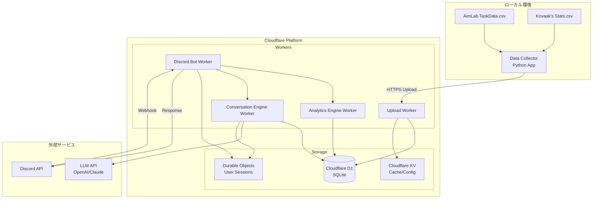
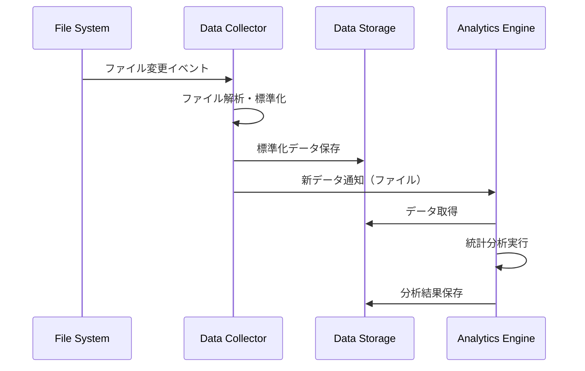
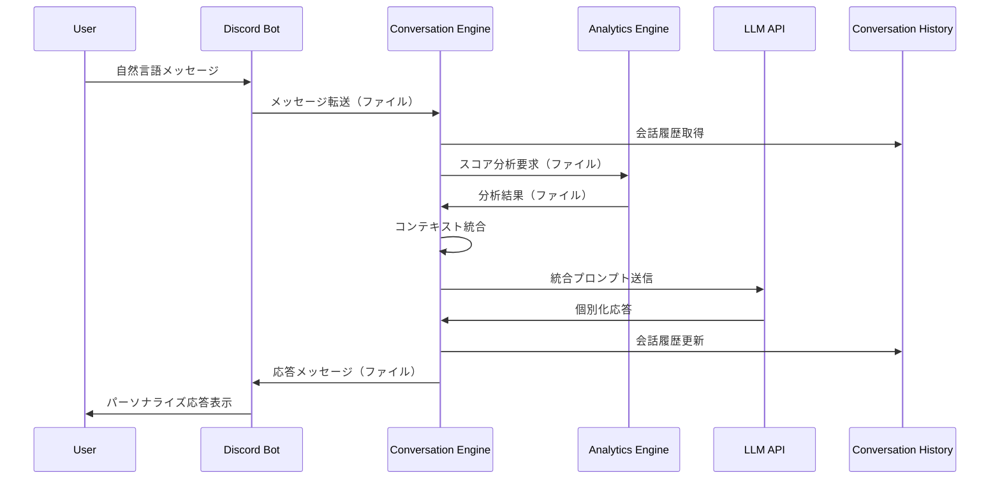

# 技術設計書

## 概要
AimCoachは、AimLabとKovaaaksのスコアデータを収集・分析し、LLMベースの対話型インターフェースを通じて個別ユーザーに最適化されたエイムトレーニング指導を提供するクラウドネイティブシステムです。

**目的**: スケーラブルなクラウド環境でスコアデータと会話履歴を統合した自然言語でのエイムトレーニングコーチングを提供します。
**ユーザー**: FPSゲームプレイヤーがどこからでもアクセス可能なDiscord環境で、日常的な対話を通じてエイム技術向上のための具体的で実行可能なアドバイスを得られます。
**影響**: 従来のローカル処理の制限を超えて、クラウドベースの高性能分析と24/7利用可能なサービスを実現します。

### 目標
- ローカルスコアファイル収集とクラウド自動同期
- Cloudflare Workers上での高速統計分析と評価
- LLMによる自然言語対話とパーソナライズされたアドバイス生成
- Cloudflare D1での会話履歴とスコア傾向の永続化
- サーバーレス環境での自動スケーリングと可用性確保

### 対象外
- リアルタイムゲーム内オーバーレイ機能
- 他ユーザーとのスコア比較・ランキング機能（初期バージョン）
- 音声対話インターフェース
- 複雑なデータ可視化ダッシュボード

## アーキテクチャ

### 高レベルアーキテクチャ



### テクノロジー選択と設計決定

#### 核心技術スタック
**Data Collector**: Python + Watchdog + Requests
- **選択理由**: ローカルファイル監視の信頼性とHTTPS Upload機能
- **代替案考慮**: Node.js（統一性は良いが、データ解析でPythonが優位）

**Discord Bot**: Cloudflare Workers + TypeScript
- **選択理由**: サーバーレスでの高可用性とDiscord Webhook対応
- **代替案考慮**: Node.js VPS（制御は良いが、運用コスト・可用性で劣る）

**Analytics Engine**: Cloudflare Workers + D1 SQLite
- **選択理由**: サーバーレス環境での高速データ処理と自動スケーリング
- **代替案考慮**: Python + pandas（高機能だが、クラウド統合とコストで劣る）

**Conversation Engine**: Cloudflare Workers + AI API
- **選択理由**: Workers AI対応とLLM API統合の最適化
- **代替案考慮**: 独立サーバー（機能は豊富だが、運用・統合コストで劣る）

**データストレージ**: Cloudflare D1 + KV + Durable Objects
- **選択理由**: サーバーレス環境での完全統合とグローバル展開
- **代替案考慮**: PostgreSQL（高機能だが、運用コスト・統合複雑さで劣る）

**LLM API**: Cloudflare Workers AI または OpenAI API
- **選択理由**: Cloudflare統合の最適化とコスト効率
- **代替案考慮**: Anthropic Claude（高品質だが、統合・コストで劣る）

#### 主要設計決定

**決定1: プロセス分離によるモジュラー構成（4コンポーネント）**
- **コンテキスト**: データ収集、分析、対話、インターフェースの異なる技術要件
- **代替案**: モノリシック構成、マイクロサービス構成
- **選択したアプローチ**: 独立プロセス + ファイル/IPC通信（4つのサービス）
- **根拠**: 開発の並行性、障害隔離、技術スタック最適化、LLM統合の柔軟性
- **トレードオフ**: システム複雑さ vs 保守性・拡張性・専門性

**決定2: 外部LLM APIの採用**
- **コンテキスト**: 高品質な対話と技術的アドバイスの生成が必要
- **代替案**: ローカルLLM（Ollama等）、ルールベースシステム
- **選択したアプローチ**: クラウドLLM API + 代替応答システム
- **根拠**: 対話品質の最大化、個人利用での運用コスト削減
- **トレードオフ**: 外部依存・コスト vs 対話品質・保守性

**決定3: 会話履歴とスコアデータの統合分析**
- **コンテキスト**: 数値データだけでなく個人状況を含めた包括的アドバイス
- **代替案**: 分離された分析、スコア優先アプローチ
- **選択したアプローチ**: 会話コンテキスト + スコア傾向の統合プロンプト
- **根拠**: パーソナライズされた実行可能なアドバイス生成
- **トレードオフ**: 複雑性 vs アドバイス品質・個別適合性

**決定4: ファイルベースのプロセス間通信（拡張）**
- **コンテキスト**: 4つの異なる言語・技術のプロセス間でリッチなデータ連携が必要
- **代替案**: HTTP API、メッセージキュー、共有メモリ
- **選択したアプローチ**: JSON + 会話履歴ファイル + 非同期通知
- **根拠**: シンプルさ、デバッグ容易性、会話データの永続化
- **トレードオフ**: リアルタイム性 vs 実装・運用の簡素さ

## システムフロー

### データ収集フロー



### 対話型インタラクションフロー



## 要件トレーサビリティ

| 要件 | 要件概要 | コンポーネント | インターフェース | フロー |
|------|----------|----------------|------------------|--------|
| 1.1-1.6 | スコア収集とファイル監視 | Data Collector | Watchdog API, File Parser | データ収集フロー |
| 2.1-2.6 | データ分析とレポート生成 | Analytics Engine | pandas/numpy, SQLite | 分析実行フロー |
| 3.1-3.6 | LLM対話エンジン | Conversation Engine | OpenAI/Anthropic SDK | 対話型インタラクション |
| 4.1-4.7 | Discord インターフェース | Discord Bot | Discord.js v14 | ユーザーインタラクション |
| 5.1-5.7 | ツール間通信 | 全コンポーネント | JSON + 会話履歴ファイル | プロセス間連携 |

## コンポーネントと インターフェース

### データ収集層

#### Data Collector Service

**責任と境界**
- **主要責任**: AimLab/Kovaaasローカルファイルの監視と標準化
- **ドメイン境界**: ファイル収集・解析・標準化処理
- **データ所有権**: 生スコアデータと標準化後データの変換
- **トランザクション境界**: 単一ファイル処理単位での整合性

**依存関係**
- **インバウンド**: Web UI (オプション), CLI管理ツール
- **アウトバウンド**: ローカルファイルシステム, Analytics Engine
- **外部**: Python Watchdog, pandas ライブラリ

**契約定義**

**サービスインターフェース**:
```python
class DataCollectorService:
    def start_monitoring(self, config: MonitoringConfig) -> Result[None, CollectorError]
    def stop_monitoring(self) -> Result[None, CollectorError]
    def collect_manual(self, time_range: TimeRange) -> Result[CollectionStats, CollectorError]
    def get_status(self) -> MonitoringStatus
```

**設定契約**:
```python
@dataclass
class MonitoringConfig:
    aimlab_paths: List[str]
    kovaaks_paths: List[str]
    output_directory: str
    polling_interval: int = 1  # seconds
    auto_start: bool = True
```

**データ出力契約**:
```python
@dataclass
class StandardizedScore:
    timestamp: datetime
    game_type: Literal["aimlab", "kovaaks"]
    scenario_name: str
    score: float
    accuracy: Optional[float]
    reaction_time: Optional[float]
    metadata: Dict[str, Any]
```

**エラーハンドリング**:
- **前提条件**: 指定されたファイルパスが読み取り可能
- **後処理条件**: 標準化データの形式検証完了
- **不変条件**: データの完全性と時系列順序の保持

### データ分析層

#### Analytics Engine Service

**責任と境界**
- **主要責任**: スコアデータの統計分析とトレンド評価
- **ドメイン境界**: データ分析・パターン認識・数値評価
- **データ所有権**: 分析結果、トレンド、パフォーマンス評価
- **トランザクション境界**: 分析セッション単位での結果整合性

**依存関係**
- **インバウンド**: Conversation Engine, Discord Bot, CLI Interface
- **アウトバウンド**: Data Collector (間接的), SQLite Database
- **外部**: pandas, numpy, scikit-learn (オプション)

**契約定義**

**サービスインターフェース**:
```python
class AnalyticsEngine:
    def analyze_performance(self, user_id: str, time_range: TimeRange) -> Result[PerformanceReport, AnalysisError]
    def get_trend_analysis(self, user_id: str, metrics: List[str]) -> Result[TrendReport, AnalysisError]
    def generate_context_summary(self, user_id: str) -> Result[ContextSummary, AnalysisError]
    def process_new_data(self, data_notification: DataNotification) -> Result[None, AnalysisError]
```

**分析結果契約**:
```python
@dataclass
class PerformanceReport:
    user_id: str
    period: TimeRange
    overall_score: float
    skill_breakdown: Dict[str, SkillMetrics]
    improvement_areas: List[ImprovementArea]
    progress_trend: TrendDirection

@dataclass
class ContextSummary:
    recent_performance: str
    key_strengths: List[str]
    improvement_areas: List[str]
    statistical_trends: Dict[str, float]
```

### 対話処理層

#### Conversation Engine Service

**責任と境界**
- **主要責任**: LLM API連携と会話コンテキスト管理、スコアデータとの統合
- **ドメイン境界**: 自然言語処理・会話履歴管理・パーソナライズされたアドバイス生成
- **データ所有権**: 会話履歴、対話コンテキスト、個別化プロンプト
- **トランザクション境界**: 単一対話セッション単位での応答整合性

**依存関係**
- **インバウンド**: Discord Bot, CLI Interface, Web Interface
- **アウトバウンド**: Analytics Engine, SQLite Database, LLM API
- **外部**: OpenAI SDK, Anthropic SDK, requests

**外部依存関係調査**:
- **OpenAI API**: GPT-4oモデル使用、トークン制限8K入力/4K出力、レート制限RPM500
- **Anthropic Claude API**: Claude-3-sonnetモデル、200Kコンテキスト、JSONモード対応
- **認証**: APIキー方式、環境変数での管理が推奨
- **エラーハンドリング**: 429 (レート制限), 500 (サーバーエラー) の自動リトライ機能

**契約定義**

**サービスインターフェース**:
```python
class ConversationEngine:
    def process_message(self, user_id: str, message: str, context: ConversationContext) -> Result[ConversationResponse, ConversationError]
    def get_conversation_history(self, user_id: str, limit: int = 10) -> Result[List[ConversationTurn], ConversationError]
    def generate_advice(self, user_id: str, topic: str) -> Result[AdviceResponse, ConversationError]
    def update_user_context(self, user_id: str, context_update: ContextUpdate) -> Result[None, ConversationError]
```

**対話契約**:
```python
@dataclass
class ConversationResponse:
    message: str
    confidence: float
    used_score_data: bool
    fallback_used: bool
    token_usage: TokenUsage

@dataclass  
class ConversationContext:
    user_id: str
    recent_scores: Optional[PerformanceReport]
    conversation_history: List[ConversationTurn]
    user_preferences: Dict[str, Any]
    emotional_state: Optional[str]
```

**状態管理**:
- **状態モデル**: IDLE -> PROCESSING -> WAITING_LLM -> COMPLETED -> ERROR
- **永続化**: 会話履歴の暗号化SQLiteストレージ
- **並行性**: ユーザー別セッション管理と非同期LLM API呼び出し

### インターフェース層

#### Discord Bot Service

**責任と境界**
- **主要責任**: Discord API連携、コマンド・自然言語メッセージの処理、ユーザーセッション管理
- **ドメイン境界**: コマンド処理・メッセージルーティング・応答フォーマット・セッション管理
- **データ所有権**: ユーザーセッション状態、Discord特有の表示設定
- **トランザクション境界**: コマンド/メッセージ実行単位での応答保証

**依存関係**
- **インバウンド**: Discord Platform, Discord Users
- **アウトバウンド**: Conversation Engine, Analytics Engine, Data Collector (status)
- **外部**: Discord.js v14, Node.js runtime

**契約定義**

**APIコントラクト**:
| Method | Command/Input | Request | Response | Errors |
|--------|---------------|---------|----------|--------|
| POST | /analysis | AnalysisRequest | PerformanceEmbed | 400, 404, 500 |
| POST | /training | ConversationRequest | ConversationEmbed | 400, 404, 500 |
| POST | mention/DM | NaturalLanguageMessage | ConversationResponse | 400, 429, 500 |
| GET | /status | StatusRequest | StatusEmbed | 500 |

**コマンドインターフェース**:
```typescript
interface BotCommandHandler {
  name: string;
  description: string;
  execute(interaction: CommandInteraction, context: BotContext): Promise<InteractionResponse>;
}

interface BotMessageHandler {
  canHandle(message: Message): boolean;
  execute(message: Message, context: BotContext): Promise<MessageResponse>;
}

interface BotContext {
  conversationEngine: ConversationEngineClient;
  analyticsEngine: AnalyticsEngineClient;
  dataCollector: DataCollectorClient;
  userSettings: UserSettingsService;
}
```

**統合戦略**:
- **修正アプローチ**: 新規開発（コマンド + 自然言語の両対応）
- **後方互換性**: 初期バージョンのため該当なし
- **移行パス**: 段階的な会話機能追加とユーザー学習サポート

## データモデル

### ドメインモデル

**コア概念**:
- **スコアエンティティ**: ゲームセッションの成績記録（一意性: timestamp + user + scenario）
- **分析結果**: パフォーマンス評価の算出結果（時間範囲での集約データ）
- **会話履歴**: ユーザーとの対話記録と感情状態情報（暗号化保存）
- **対話コンテキスト**: 現在の会話状況とユーザーの個人的状態
- **ユーザー設定**: 個人設定、ファイルパス情報、LLM設定（暗号化保存）

**ビジネスルール**:
- スコアデータは時系列順序で保持され、削除されない（分析精度のため）
- 同一タイムスタンプでの複数スコアは最新データが優先される
- 分析結果は元データ変更時に自動的に無効化される
- 会話履歴は個人プライバシー保護のため暗号化保存される
- 対話コンテキストはセッション終了後も一定期間保持される（継続性のため）

### 物理データモデル

**Cloudflare D1 データベース設計**:
```sql
-- AimLabスコアデータテーブル（実データ構造基準）
CREATE TABLE aimlab_scores (
    id INTEGER PRIMARY KEY AUTOINCREMENT,
    user_id TEXT NOT NULL,
    task_id TEXT NOT NULL, -- taskId from TaskData.csv
    klutch_id TEXT, -- klutchId
    play_id TEXT, -- playId (UUID)
    task_name TEXT NOT NULL, -- taskName
    score REAL NOT NULL,
    mode INTEGER, -- mode
    weapon_type TEXT, -- weaponType
    weapon_name TEXT, -- weaponName
    performance_class TEXT, -- performanceClass
    performance_json TEXT, -- performance JSON data
    started_at DATETIME, -- startedAt
    ended_at DATETIME, -- endedAt
    created_date DATETIME, -- createDate from CSV
    uploaded_at DATETIME DEFAULT CURRENT_TIMESTAMP
);

-- Kovaaaksスコアデータテーブル（実データ構造基準）
CREATE TABLE kovaaks_scores (
    id INTEGER PRIMARY KEY AUTOINCREMENT,
    user_id TEXT NOT NULL,
    scenario_name TEXT NOT NULL, -- extracted from filename
    session_date DATETIME NOT NULL, -- extracted from filename timestamp
    weapon TEXT, -- Weapon from Stats section
    shots INTEGER, -- Shots
    hits INTEGER, -- Hits
    damage_done REAL, -- Damage Done
    damage_possible REAL, -- Damage Possible
    kills INTEGER DEFAULT 0, -- Kills
    fight_time REAL DEFAULT 0.0, -- Fight Time
    avg_ttk REAL DEFAULT 0.0, -- Avg TTK
    hit_count INTEGER, -- Hit Count
    miss_count INTEGER, -- Miss Count
    accuracy_percent REAL, -- Calculated from hits/shots
    uploaded_at DATETIME DEFAULT CURRENT_TIMESTAMP
);

-- 分析結果キャッシュテーブル
CREATE TABLE analysis_cache (
    id INTEGER PRIMARY KEY AUTOINCREMENT,
    user_id TEXT NOT NULL,
    analysis_type TEXT NOT NULL,
    time_range_start DATETIME NOT NULL,
    time_range_end DATETIME NOT NULL,
    result_data TEXT NOT NULL, -- JSON format
    created_at DATETIME DEFAULT CURRENT_TIMESTAMP,
    expires_at DATETIME NOT NULL
);

-- 会話履歴テーブル
CREATE TABLE conversation_history (
    id INTEGER PRIMARY KEY AUTOINCREMENT,
    user_id TEXT NOT NULL,
    message_id TEXT NOT NULL, -- Discord message ID
    role TEXT NOT NULL CHECK (role IN ('user', 'assistant')),
    content TEXT NOT NULL,
    context_data TEXT, -- JSON: emotional_state, score_references
    timestamp DATETIME DEFAULT CURRENT_TIMESTAMP,
    token_usage INTEGER DEFAULT 0,
    llm_model TEXT
);

-- ユーザー設定テーブル
CREATE TABLE user_settings (
    user_id TEXT PRIMARY KEY,
    discord_user_id TEXT UNIQUE,
    settings_data TEXT NOT NULL, -- JSON config
    last_sync DATETIME,
    created_at DATETIME DEFAULT CURRENT_TIMESTAMP,
    updated_at DATETIME DEFAULT CURRENT_TIMESTAMP
);

-- インデックス設計
CREATE INDEX idx_aimlab_user_date ON aimlab_scores(user_id, created_date DESC);
CREATE INDEX idx_aimlab_task_name ON aimlab_scores(task_name);
CREATE INDEX idx_kovaaks_user_date ON kovaaks_scores(user_id, session_date DESC);
CREATE INDEX idx_kovaaks_scenario ON kovaaks_scores(scenario_name);
CREATE INDEX idx_analysis_cache_user_type ON analysis_cache(user_id, analysis_type);
CREATE INDEX idx_conversation_user_timestamp ON conversation_history(user_id, timestamp DESC);
```

### データコントラクト & 統合

**プロセス間通信スキーマ**:
```json
{
  "data_notification": {
    "type": "new_scores_available",
    "timestamp": "2025-09-13T01:00:00Z",
    "file_path": "/data/standardized/scores_20250913.json",
    "record_count": 15,
    "checksum": "sha256_hash"
  },
  
  "analysis_request": {
    "type": "generate_analysis",
    "user_id": "default_user",
    "analysis_type": "performance_report",
    "time_range": {
      "start": "2025-09-01T00:00:00Z",
      "end": "2025-09-13T23:59:59Z"
    },
    "response_file": "/tmp/analysis_response.json"
  },
  
  "conversation_request": {
    "type": "process_message",
    "user_id": "default_user",
    "message": "最近エイムが悪くて困っています",
    "context": {
      "discord_channel_id": "123456789",
      "message_id": "987654321",
      "emotional_indicators": ["frustrated", "concerned"]
    },
    "response_file": "/tmp/conversation_response.json"
  },
  
  "conversation_response": {
    "message": "最近のスコアを見ると、確かに先週から精度が5%下がっているようですね。疲れているときにこうなることはよくあります。今日はどんな感じでしたか？",
    "confidence": 0.85,
    "used_score_data": true,
    "score_references": ["accuracy_trend", "recent_sessions"],
    "suggested_actions": ["rest", "basic_drills"],
    "emotional_tone": "supportive"
  }
}
```

**スキーマバージョニング**:
- セマンティックバージョニング（major.minor.patch）
- 後方互換性維持期間：1メジャーバージョン
- スキーマ進化パターン：アディティブ変更優先

## エラーハンドリング

### エラー戦略
個人利用向けシステムのため、ユーザビリティを重視し、LLM API障害時の代替応答を含む実用的なエラーハンドリングを実装します。

### エラーカテゴリと対応
**ファイルアクセスエラー**: ファイルが見つからない → 設定ガイダンス表示と自動パス検索機能
**データ解析エラー**: 破損ファイル → エラー詳細ログ出力とスキップ処理で継続動作
**プロセス間通信エラー**: サービス未応答 → タイムアウト設定と代替手段（キャッシュ利用）の提示
**Discord API エラー**: レート制限 → 自動リトライと適切な待機時間実装
**LLM API エラー**: サービス停止・レート制限 → 基本分析結果による代替応答生成と明確な状況説明
**会話コンテキストエラー**: 履歴破損・暗号化失敗 → セッション初期化と新規会話開始の案内

### 監視とログ
**ローカルログファイル**: 回転式ログファイル（10MB x 5世代）による詳細記録（会話内容は暗号化）
**ヘルスチェック**: 各サービスの生存監視とLLM API可用性チェック
**メトリクス**: 処理成功率、応答時間、エラー頻度、LLM API使用量の基本統計

## テスト戦略

### 単体テスト
- **Data Collector**: ファイル解析ロジック、データ標準化処理、監視機能
- **Analytics Engine**: 統計計算アルゴリズム、トレンド分析、コンテキスト要約生成
- **Conversation Engine**: プロンプト生成、会話履歴管理、LLM API連携、代替応答生成
- **Discord Bot**: コマンドハンドラ、自然言語メッセージ処理、メッセージフォーマット、エラー応答

### 統合テスト
- **プロセス間通信**: JSON ファイル経由でのデータ連携、エラー伝播、会話データ伝送
- **LLM統合**: 実際のLLM API呼び出しとレスポンス処理、エラーハンドリング
- **エンドツーエンド**: ファイル変更から対話型Discord応答まで完全フロー
- **設定管理**: 各サービス間での設定変更伝播と整合性

### パフォーマンステスト
- **大量データ処理**: 1年分のスコアデータ（10,000レコード）での分析性能
- **会話履歴処理**: 長期間の会話データ（1,000件）での応答性能
- **LLM API制限**: レート制限下での応答品質と代替機能の動作
- **同時実行**: 複数インターフェースからの同時リクエスト処理

## セキュリティ考慮事項

### 個人利用向けセキュリティ
**ファイルシステムアクセス**: 読み取り専用権限での最小限アクセス、パストラバーサル対策
**設定ファイル保護**: 機密情報（LLM APIキー、パス情報）の暗号化保存、適切なファイル権限設定
**Discord Token管理**: 環境変数での管理、.envファイルの適切な除外設定
**LLM API キー管理**: 環境変数または暗号化設定ファイル、定期的なキーローテーション推奨

### データプライバシー
**会話データ保護**: 会話履歴とコンテキストデータの完全暗号化保存
**LLM API通信**: 個人を特定できる情報の最小化、セッション管理による一時性確保
**データ削除**: ユーザー要求時の完全データ消去（会話履歴、コンテキスト、設定を含む）
**外部依存の制限**: LLM API以外は完全ローカル処理により個人情報保護