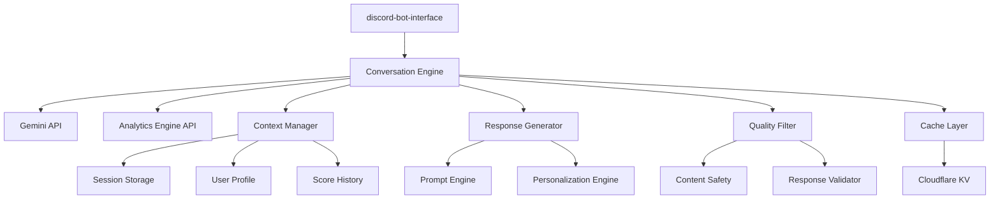
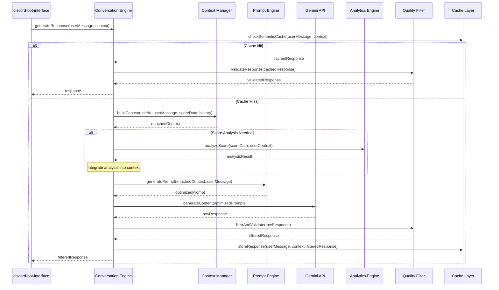
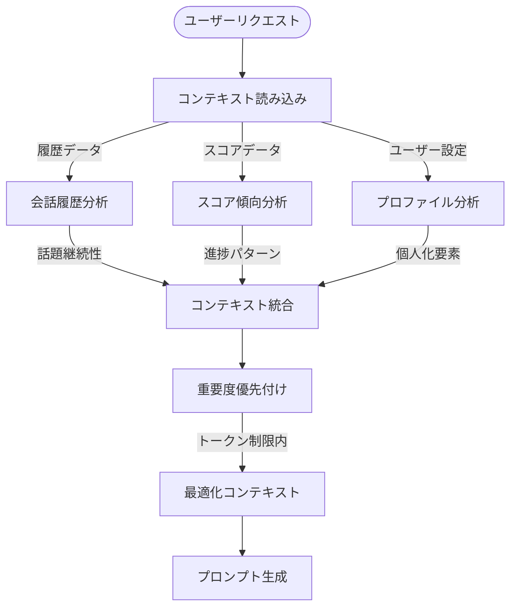
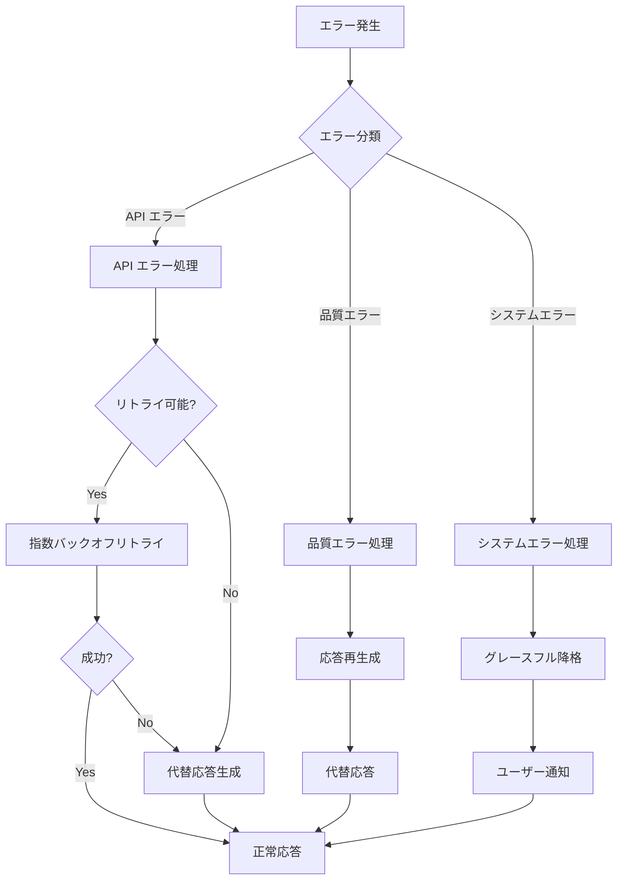

# 設計文書

## 概要

Conversation Engineは、Gemini APIを活用したインテリジェントな対話エンジンです。FPSプレイヤーのエイムトレーニングにおける包括的なコーチング体験を提供するため、ユーザーのスコアデータ、過去の会話履歴、個人の学習パターンを統合し、パーソナライズされた自然言語応答を生成します。

主にdiscord-bot-interfaceから呼び出され、ユーザーの質問や状況に応じて文脈を理解した適切なアドバイス、励まし、技術指導を日本語で提供します。システムはCloudflare Workers上で動作し、リアルタイムの対話体験と高いスケーラビリティを実現します。

### 目標
- ユーザーのスコアデータと会話履歴を活用した高度にパーソナライズされた対話生成
- 自然で理解しやすい日本語による技術指導とモチベーション支援
- Discord環境での最適化された応答フォーマットとユーザー体験
- Cloudflare Workers制約内での高性能・高可用性の実現

### 非目標
- リアルタイムゲーム分析や画面解析機能
- 複数言語対応（初期バージョンでは日本語のみ）
- 独立したチャットボットとしての機能（discord-bot-interface経由のみ）

## アーキテクチャ

### 高レベルアーキテクチャ



### 技術スタック

**ランタイム環境**:
- **Cloudflare Workers**: サーバーレス実行環境、エッジでの低レイテンシ処理
- **TypeScript**: 型安全性とコード品質の確保

**外部API統合**:
- **Gemini API**: 高品質な自然言語生成とコンテキスト理解
- **Analytics Engine API**: 会話中のスコア分析要求時の専門的分析取得
- **選択理由**: 日本語対応の優秀性、豊富なコンテキスト長、費用対効果
- **代替案検討**: GPT-4 (コスト高)、Claude (API制限)

**エージェント・ワークフローフレームワーク（許可済み）**:
- **Mastra**: エージェントとワークフロー構築の簡素化
- **その他類似フレームワーク**: LangChain、Vercel AI SDK、AutoGen等の使用を許可

**フレームワーク選定基準**:
1. **Cloudflare Workers互換性**: Cloudflare Workers環境での動作保証
2. **TypeScript完全サポート**: 型安全性と開発体験の向上
3. **Gemini API統合**: Gemini APIとのネイティブまたは容易な統合
4. **軽量性**: 128MBメモリ制限内での効率的動作
5. **ワークフロー表現力**: 複雑な対話フローを直感的に記述可能
6. **エラーハンドリング**: 堅牢なエラー処理とリカバリ機構
7. **拡張性**: カスタムエージェントやツールの追加容易性
8. **コミュニティ**: アクティブな開発とドキュメンテーション

**実装選択肢**:
- **Option A**: Mastraによるエージェントベース実装
- **Option B**: 従来のサービス層アーキテクチャ
- **推奨アプローチ**: タスクフェーズでの具体的評価に基づく選定

**データストレージ**:
- **Cloudflare KV**: 応答キャッシュとユーザー設定
- **Session Storage**: 会話コンテキストの一時保存（discord-bot-interface経由）

### 主要設計決定

**決定1: コンテキスト統合アーキテクチャ**
- **決定**: 全てのユーザーコンテキスト（スコア、履歴、設定）を単一のプロンプトに統合
- **背景**: パーソナライズされた一貫性のある応答生成の必要性
- **代替案**: 分散処理とポストプロセシング、マルチステップ推論、RAG実装
- **選択アプローチ**: Context Managerが全情報を構造化し、Prompt Engineが最適化されたプロンプトを生成
- **根拠**: Gemini APIの長いコンテキスト長を活用し、単一API呼び出しで完結することで低レイテンシと一貫性を実現
- **トレードオフ**: 単純性と性能を重視、複雑なRAGシステムの運用コストを回避

**決定2: 品質保証レイヤー分離**
- **決定**: LLM出力後の独立した品質フィルタリングシステム
- **背景**: 教育コンテンツとしての品質保証と不適切コンテンツの排除
- **代替案**: プロンプト内制約のみ、マルチモデル検証、人手レビューワークフロー
- **選択アプローチ**: ルールベースとヒューリスティックによる多層フィルタリング
- **根拠**: 確実性とレスポンス時間のバランス、運用コストの最適化
- **トレードオフ**: 完全自動化を優先、高度なAI検閲機能は将来的な改善項目

**決定3: キャッシュ戦略**
- **決定**: セマンティックキャッシュによる応答最適化
- **背景**: Gemini API呼び出しコストとレスポンス時間の最適化
- **代替案**: 完全キャッシュなし、単純な文字列マッチ、エンベディングベース
- **選択アプローチ**: 質問の意図と文脈をハッシュ化し、類似状況での応答再利用
- **根拠**: 頻繁な類似質問に対する効率的な処理、API使用量の削減
- **トレードオフ**: キャッシュヒット率を重視、完全な独自性よりも効率性を優先

## システムフロー

### 対話生成フロー



### コンテキスト管理フロー



## 要件トレーサビリティ

| 要件 | 要件概要 | 担当コンポーネント | インターフェース | 対応フロー |
|------|----------|-------------------|------------------|------------|
| 1.1-1.5 | 自然言語対話生成 | Response Generator, Quality Filter | generateResponse(), filterContent() | 対話生成フロー |
| 2.1-2.5 | スコアデータ統合 | Context Manager, Personalization Engine | buildScoreContext(), personalizeAdvice() | コンテキスト管理フロー |
| 3.1-3.5 | 会話履歴管理 | Context Manager, Session Storage | manageConversationHistory() | コンテキスト管理フロー |
| 4.1-4.5 | Gemini API統合 | Gemini API Connector, Error Handler | callGeminiAPI(), handleAPIErrors() | 対話生成フロー |
| 5.1-5.5 | Discord連携 | Response Formatter, API Gateway | formatDiscordResponse() | 対話生成フロー |
| 6.1-6.5 | パーソナライゼーション | Personalization Engine, User Profile | adaptToUser(), learnFromFeedback() | コンテキスト管理フロー |

## コンポーネントと インターフェース

### コア対話処理

#### Conversation Engine

**責任と境界**
- **主要責任**: 全体的な対話フローの調整と品質保証された応答の生成
- **ドメイン境界**: 対話生成とコンテキスト処理のオーケストレーション
- **データ所有権**: 対話セッション状態と応答品質メトリクス
- **トランザクション境界**: 単一対話リクエストの完全処理

**依存関係**
- **インバウンド**: discord-bot-interface（対話リクエスト）
- **アウトバウンド**: Context Manager, Response Generator, Quality Filter
- **外部**: Gemini API, Cloudflare KV

**サービスインターフェース**
```typescript
interface ConversationEngineService {
  generateResponse(request: ConversationRequest): Promise<Result<ConversationResponse, ConversationError>>;
  validateHealth(): Promise<HealthStatus>;
}

interface ConversationRequest {
  userId: string;
  message: string;
  context: ConversationContext;
  options?: ResponseOptions;
}

interface ConversationResponse {
  response: string;
  confidence: number;
  responseType: 'advice' | 'encouragement' | 'analysis' | 'question';
  metadata: ResponseMetadata;
}
```

**事前条件**: 有効なユーザーIDとメッセージが提供される
**事後条件**: 品質保証された応答または明確なエラーメッセージが返される
**不変条件**: ユーザープライバシーが保護され、不適切コンテンツが除外される

#### Context Manager

**責任と境界**
- **主要責任**: ユーザーコンテキストの統合と最適化
- **ドメイン境界**: 会話履歴、スコアデータ、ユーザー設定の管理
- **データ所有権**: コンテキスト統合ロジックと優先度アルゴリズム

**サービスインターフェース**
```typescript
interface ContextManagerService {
  buildEnrichedContext(userId: string, currentMessage: string): Promise<Result<EnrichedContext, ContextError>>;
  updateConversationHistory(userId: string, interaction: ConversationInteraction): Promise<Result<void, ContextError>>;
  analyzeUserPatterns(userId: string): Promise<Result<UserPatterns, ContextError>>;
}

interface EnrichedContext {
  conversationHistory: ConversationEntry[];
  scoreAnalysis: ScoreAnalysis;
  userProfile: UserProfile;
  contextPriority: ContextPriority;
  tokenBudget: TokenBudget;
}
```

### LLM統合レイヤー

#### Gemini API Connector

**責任と境界**
- **主要責任**: Gemini APIとの安全で効率的な通信
- **ドメイン境界**: 外部LLMサービスとの境界
- **データ所有権**: API応答キャッシュとレート制限状態

**外部依存関係調査**
- **Gemini API 仕様**: text-generation, chat-completion エンドポイント
- **認証方式**: API Key-based authentication
- **レート制限**: 毎分60リクエスト、毎日1000リクエスト（調査対象）
- **コンテキスト長**: 最大32K トークン（日本語換算約16K文字）
- **レスポンス時間**: 通常2-8秒、長文生成で最大15秒
- **エラーパターン**: 429 (Rate Limit), 400 (Invalid Request), 500 (Server Error)

**サービスインターフェース**
```typescript
interface GeminiAPIConnector {
  generateContent(prompt: OptimizedPrompt, options: GenerationOptions): Promise<Result<GeminiResponse, APIError>>;
  validateAPIHealth(): Promise<APIHealthStatus>;
  getUsageMetrics(): Promise<APIUsageMetrics>;
}

interface GenerationOptions {
  temperature: number;
  maxTokens: number;
  safetySettings: SafetySettings;
  timeoutMs: number;
}
```

#### Prompt Engine

**責任と境界**
- **主要責任**: コンテキストに基づく最適化されたプロンプト生成
- **ドメイン境界**: LLMプロンプト最適化とテンプレート管理

**サービスインターフェース**
```typescript
interface PromptEngineService {
  generateOptimizedPrompt(context: EnrichedContext, userMessage: string): Promise<OptimizedPrompt>;
  updatePromptTemplates(templates: PromptTemplates): Promise<Result<void, PromptError>>;
}

interface OptimizedPrompt {
  systemPrompt: string;
  userPrompt: string;
  contextSummary: string;
  tokenCount: number;
  optimizationMetrics: PromptMetrics;
}
```

### 品質保証レイヤー

#### Quality Filter

**責任と境界**
- **主要責任**: 生成応答の品質検証と不適切コンテンツフィルタリング
- **ドメイン境界**: コンテンツ安全性と教育適合性

**サービスインターフェース**
```typescript
interface QualityFilterService {
  filterAndValidate(response: string, context: ValidationContext): Promise<Result<FilteredResponse, FilterError>>;
  updateFilterRules(rules: FilterRules): Promise<Result<void, FilterError>>;
}

interface FilteredResponse {
  content: string;
  qualityScore: number;
  safetyScore: number;
  modifications: ContentModification[];
  approval: 'approved' | 'modified' | 'rejected';
}
```

### パーソナライゼーション

#### Personalization Engine

**責任と境界**
- **主要責任**: ユーザー固有の学習パターン分析と応答カスタマイズ
- **ドメイン境界**: 個人化アルゴリズムとユーザー適応

**サービスインターフェース**
```typescript
interface PersonalizationEngineService {
  personalizeResponse(baseResponse: string, userProfile: UserProfile): Promise<PersonalizedResponse>;
  learnFromFeedback(userId: string, feedback: UserFeedback): Promise<Result<void, LearningError>>;
  analyzeUserPreferences(userId: string): Promise<UserPreferences>;
}

interface PersonalizedResponse {
  content: string;
  adaptations: PersonalizationAdaptation[];
  confidenceLevel: number;
}
```

## データモデル

### ドメインモデル

**コア概念**:
- **Conversation Session**: 対話セッションの状態とライフサイクル
- **User Context**: ユーザーの包括的コンテキスト情報
- **Response Quality**: 応答品質の評価基準
- **Learning Pattern**: ユーザー学習パターンの抽出

**ビジネスルール**:
- 個人情報は最小化され、Discord User IDのみで識別される
- 会話履歴は一定期間後に要約・圧縮される
- 品質スコアが閾値を下回る応答は代替応答に置換される

### 論理データモデル

```typescript
interface ConversationContext {
  userId: string;
  sessionId: string;
  conversationHistory: ConversationEntry[];
  userProfile: UserProfile;
  scoreHistory: ScoreEntry[];
  preferences: UserPreferences;
  timestamp: Date;
}

interface ConversationEntry {
  id: string;
  timestamp: Date;
  userMessage: string;
  assistantResponse: string;
  context: string;
  sentiment: SentimentAnalysis;
  topics: string[];
}

interface UserProfile {
  userId: string;
  skillLevel: 'beginner' | 'intermediate' | 'advanced';
  favoriteGames: string[];
  trainingFrequency: TrainingFrequency;
  communicationStyle: CommunicationStyle;
  motivationFactors: string[];
  lastInteraction: Date;
}

interface ScoreEntry {
  id: string;
  gameTitle: string;
  scenario: string;
  score: number;
  accuracy: number;
  reactionTime: number;
  timestamp: Date;
  improvements: string[];
  challenges: string[];
}
```

### APIデータ転送

**リクエスト・レスポンススキーマ**:
```typescript
interface ConversationRequest {
  userId: string;
  message: string;
  context?: {
    conversationHistory?: ConversationEntry[];
    recentScores?: ScoreEntry[];
    sessionState?: SessionState;
  };
  options?: {
    responseStyle?: 'formal' | 'casual' | 'motivational';
    maxLength?: number;
    includeAdvice?: boolean;
  };
}

interface ConversationResponse {
  success: boolean;
  data: {
    response: string;
    responseType: ResponseType;
    confidence: number;
    suggestions?: string[];
    followUpQuestions?: string[];
  };
  metadata: {
    processingTime: number;
    tokenUsage: number;
    cacheHit: boolean;
  };
  timestamp: string;
}
```

## エラーハンドリング

### エラー戦略

対話システムにおける各エラータイプに対して、ユーザー体験を維持しながら適切な降格処理を実装します。

### エラーカテゴリと対応

**ユーザーエラー (400番台)**:
- **無効な入力** → 入力形式の説明と例示; **空メッセージ** → 質問の促進; **文字数超過** → 簡潔化の提案

**システムエラー (500番台)**:
- **Gemini API障害** → 事前準備された代替応答; **タイムアウト** → 非同期処理への切り替え; **レート制限** → 待機時間の案内

**ビジネスロジックエラー (422)**:
- **コンテキスト不足** → 追加情報の要求; **品質フィルタリング** → 代替表現での再生成; **不適切コンテンツ** → 建設的な対話への誘導

### エラー処理フロー



### 監視

**エラー追跡**: Cloudflare Analytics統合によるリアルタイムエラー監視とアラート
**ログ記録**: 構造化ログによる詳細なエラーコンテキスト記録
**ヘルス監視**: Gemini API可用性、応答時間、品質スコアの継続的監視

## テストストラテジー

### 単体テスト
- **Context Manager**: コンテキスト統合ロジック、トークン制限処理、優先度アルゴリズム
- **Prompt Engine**: プロンプト最適化、テンプレート管理、トークンカウント
- **Quality Filter**: コンテンツフィルタリング、品質スコア計算、安全性チェック
- **Personalization Engine**: ユーザープロファイル分析、応答カスタマイズ

### 統合テスト
- **Gemini API連携**: API呼び出し、レスポンス処理、エラーハンドリング
- **discord-bot-interface連携**: リクエスト・レスポンス形式、エラー伝播
- **キャッシュシステム**: セマンティックキャッシュ、TTL管理、無効化
- **コンテキスト管理**: 履歴統合、スコア分析、プロファイル更新

### E2Eテスト
- **対話フロー**: 完全な対話生成プロセス、品質保証、応答時間
- **パーソナライゼーション**: ユーザー学習、応答適応、継続的改善
- **エラーシナリオ**: API障害時の降格処理、品質フィルタリング、システム復旧

### パフォーマンステスト
- **負荷テスト**: 同時対話処理、レスポンス時間維持、メモリ使用量
- **APIレート制限テスト**: 制限への対応、キューイング、降格処理

## パフォーマンス & スケーラビリティ

### 目標メトリクス

**レスポンス時間**:
- 通常対話: 10秒以内（Gemini API呼び出し含む）
- キャッシュヒット: 2秒以内
- 複雑な分析: 30秒以内（Workers制限内）

**スループット**:
- 同時対話: 50+ ユーザー
- API呼び出し効率: キャッシュヒット率 30%以上

### スケーリングアプローチ

**水平スケーリング**: Cloudflare Workersの自動スケーリング活用
**垂直最適化**: メモリ効率的なコンテキスト管理、トークン使用量最適化

### キャッシュ戦略

**セマンティックキャッシュ**: 質問意図と文脈のハッシュ化による効率的な応答再利用
**コンテキストキャッシュ**: 頻繁にアクセスされるユーザープロファイルの前処理
**応答テンプレートキャッシュ**: 一般的なアドバイスパターンの事前生成

## セキュリティ考慮事項

### 脅威モデリング

**プロンプトインジェクション攻撃**: 入力サニタイゼーション、コンテキスト分離、応答検証
**データ漏洩**: 個人情報の最小化、ログ記録制限、暗号化通信
**API悪用**: レート制限、認証トークン管理、使用量監視

### セキュリティ制御

**入力検証**: 悪意のあるプロンプト検出、コンテンツ制限、入力長制限
**出力フィルタリング**: 不適切コンテンツ除去、個人情報漏洩防止
**API セキュリティ**: HTTPS通信、トークンローテーション、使用量制限

### データ保護

**プライバシー保護**: Discord User IDのみの使用、会話履歴の期限管理
**データ最小化**: 必要最小限の情報のみ保存、自動削除ポリシー
**暗号化**: 保存時・転送時データ暗号化、セキュアなキー管理