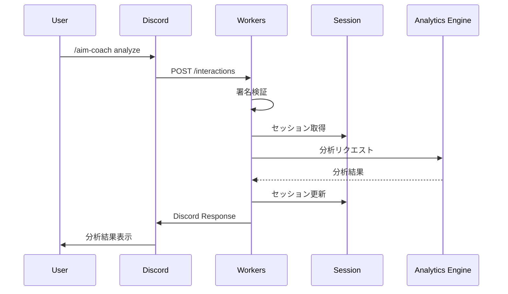
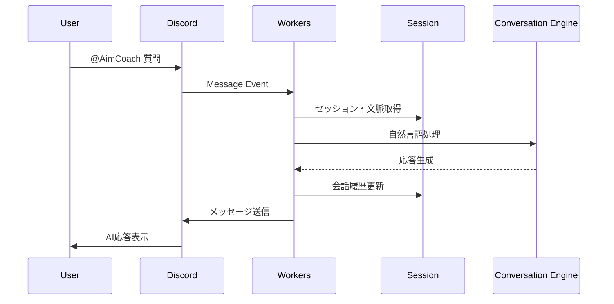

# 設計文書

## 概要

discord-bot-interface は Cloudflare Workers 上で動作する AimCoach の Discord Bot インターフェースです。スラッシュコマンド、メンション処理、Durable Objects によるセッション管理を提供し、analytics-engine および conversation-engine との連携を行います。

## システムアーキテクチャ

### 全体構成図

```
Discord API
    ↓ (Webhooks/Interactions)
┌─────────────────────────────────────┐
│ Cloudflare Workers                  │
│                                     │
│ ┌─────────────────────────────────┐ │
│ │ discord-bot-interface           │ │
│ │                                 │ │
│ │ ├── InteractionHandler          │ │
│ │ ├── CommandProcessor            │ │
│ │ ├── MentionProcessor            │ │
│ │ ├── SessionManager              │ │
│ │ ├── ServiceConnector            │ │
│ │ └── ResponseFormatter           │ │
│ └─────────────────────────────────┘ │
└─────────────────────────────────────┘
    ↓ (API Calls)
┌─────────────────┐  ┌─────────────────┐
│ analytics-engine│  │conversation-engine│
└─────────────────┘  └─────────────────┘
    ↓                    ↓
┌─────────────────────────────────────┐
│ Durable Objects (Session Storage)  │
└─────────────────────────────────────┘
```

## コンポーネント設計

### 1. エントリポイント (index.ts)

```typescript
export default {
  async fetch(request: Request, env: Env): Promise<Response> {
    const interactionHandler = new InteractionHandler(env);
    return await interactionHandler.handle(request);
  }
};
```

**責任:**
- すべての Discord インタラクションの受信
- リクエストルーティング
- 基本的なエラーハンドリング

### 2. InteractionHandler

```typescript
class InteractionHandler {
  constructor(private env: Env) {}

  async handle(request: Request): Promise<Response> {
    // Discord 署名検証
    // インタラクションタイプの判定
    // 適切なプロセッサへの振り分け
  }
}
```

**責任:**
- Discord 署名認証
- インタラクションタイプの識別（SLASH_COMMAND, MESSAGE_COMPONENT等）
- 適切なプロセッサへのリクエスト振り分け
- 基本的なレスポンス管理

### 3. CommandProcessor

```typescript
class CommandProcessor {
  async processSlashCommand(interaction: SlashCommandInteraction): Promise<InteractionResponse> {
    switch (interaction.data.name) {
      case 'help': return this.handleHelp();
      case 'analyze': return this.handleAnalyze(interaction);
      case 'training': return this.handleTraining(interaction);
      case 'status': return this.handleStatus(interaction);
    }
  }
}
```

**責任:**
- スラッシュコマンドの解析と処理
- コマンド別ロジックの実行
- パラメータ検証
- 外部サービスとの連携調整

**主要メソッド:**
- `handleHelp()`: ヘルプ情報の表示
- `handleAnalyze()`: スコア分析の開始
- `handleTraining()`: トレーニング推奨の提供
- `handleStatus()`: ユーザー状況の表示

### 4. MentionProcessor

```typescript
class MentionProcessor {
  async processMention(message: Message): Promise<void> {
    const context = await this.getThreadContext(message);
    const intent = await this.analyzeIntent(message.content);
    const response = await this.generateResponse(intent, context);
    await this.sendResponse(message.channel_id, response);
  }
}
```

**責任:**
- メンション検知と内容分析
- スレッド文脈の取得
- 自然言語理解
- conversation-engine との連携

**主要メソッド:**
- `getThreadContext()`: スレッド履歴の取得
- `analyzeIntent()`: メッセージ意図の分析
- `generateResponse()`: 適切な応答の生成

### 5. SessionManager (Durable Objects)

```typescript
class UserSession {
  constructor(private state: DurableObjectState) {}

  async getSessionData(userId: string): Promise<SessionData> {
    // セッションデータの取得
  }

  async updateSession(userId: string, data: Partial<SessionData>): Promise<void> {
    // セッションデータの更新
  }
}
```

**責任:**
- ユーザーセッションの永続化
- 会話履歴の管理
- ユーザー設定の保存
- セッションライフサイクル管理

**データ構造:**
```typescript
interface SessionData {
  userId: string;
  preferences: UserPreferences;
  conversationHistory: ConversationEntry[];
  lastInteraction: Date;
  trainingContext: TrainingContext;
}
```

### 6. ServiceConnector

```typescript
class ServiceConnector {
  async callAnalyticsEngine(request: AnalyticsRequest): Promise<AnalyticsResponse> {
    // analytics-engine への API 呼び出し
    // リトライ機構付き
  }

  async callConversationEngine(request: ConversationRequest): Promise<ConversationResponse> {
    // conversation-engine への API 呼び出し
    // タイムアウト管理付き
  }
}
```

**責任:**
- 外部サービスとの API 通信
- リトライ機構の実装
- エラーハンドリングと降格処理
- レスポンス変換

### 7. ResponseFormatter

```typescript
class ResponseFormatter {
  formatForDiscord(data: any, type: ResponseType): DiscordResponse {
    // Discord フォーマットへの変換
  }

  createErrorResponse(error: AimCoachError): DiscordResponse {
    // エラーレスポンスの生成
  }
}
```

**責任:**
- Discord API 形式への応答変換
- エラーメッセージの日本語化
- インタラクティブ要素の生成（ボタン、セレクトメニュー等）

## データフロー

### 1. スラッシュコマンド処理フロー



### 2. メンション処理フロー



## 技術仕様

### 使用ライブラリ

**許可されたサードパーティライブラリ:**
- **discord-hono**: Discord Bot開発の簡素化
- **hono**: 軽量Webフレームワーク（Cloudflare Workers最適化）
- その他実装を大幅に簡素化するライブラリ

**ライブラリ選択基準:**
1. Cloudflare Workers での動作保証
2. 実装の大幅な簡素化
3. パフォーマンス影響の最小化
4. メンテナンス性の向上

### 実装アプローチの選択肢

**Option A: discord-hono使用**
```typescript
import { DiscordHono } from 'discord-hono'

const app = new DiscordHono()

app.command('help', (c) => {
  return c.res('利用可能なコマンド一覧...')
})

app.command('analyze', async (c) => {
  // スコア分析ロジック
})
```

**Option B: 従来のfetch API**
```typescript
export default {
  async fetch(request: Request, env: Env): Promise<Response> {
    // 手動でのDiscordインタラクション処理
  }
}
```

**推奨**: 実装の簡素化とメンテナンス性を重視してOption Aを採用

### 環境変数

```typescript
interface Env {
  // Discord Bot設定
  DISCORD_TOKEN: string;
  DISCORD_PUBLIC_KEY: string;
  DISCORD_APPLICATION_ID: string;

  // 外部サービス
  ANALYTICS_ENGINE_URL: string;
  CONVERSATION_ENGINE_URL: string;
  INTERNAL_API_TOKEN: string;

  // Durable Objects
  USER_SESSION: DurableObjectNamespace;

  // KV Storage
  BOT_CONFIG: KVNamespace;
}
```

### エラーハンドリング戦略

```typescript
class AimCoachError extends Error {
  constructor(
    public code: string,
    public message: string,
    public context?: Record<string, any>
  ) {
    super(message);
  }
}

// エラータイプ
enum ErrorCode {
  DISCORD_AUTH_FAILED = 'DISCORD_AUTH_FAILED',
  EXTERNAL_SERVICE_TIMEOUT = 'EXTERNAL_SERVICE_TIMEOUT',
  SESSION_CORRUPTED = 'SESSION_CORRUPTED',
  RATE_LIMIT_EXCEEDED = 'RATE_LIMIT_EXCEEDED'
}
```

### パフォーマンス最適化

1. **レスポンス時間管理**
   - Discord タイムアウト（3秒）内での応答保証
   - 長時間処理の場合は即座に ACK + フォローアップ

2. **メモリ効率化**
   - ストリーミング処理の活用
   - 大容量データの外部ストレージ保存

3. **CPU 時間最適化**
   - 重い処理の非同期化
   - 必要に応じた処理分割

## セキュリティ設計

### 認証フロー

```typescript
async function verifyDiscordSignature(request: Request, publicKey: string): Promise<boolean> {
  const signature = request.headers.get('X-Signature-Ed25519');
  const timestamp = request.headers.get('X-Signature-Timestamp');
  const body = await request.text();

  // Ed25519 署名検証
  return verifySignature(publicKey, signature, timestamp + body);
}
```

### データ保護

1. **個人情報の最小化**
   - Discord User ID のみを識別子として使用
   - 個人情報の永続化回避

2. **ログ管理**
   - 機密情報のログ出力禁止
   - セキュリティイベントの記録

## 運用設計

### モニタリング

```typescript
interface MetricsData {
  responseTime: number;
  errorRate: number;
  activeUsers: number;
  externalServiceHealth: Record<string, boolean>;
}
```

### デプロイメント

1. **環境分離**
   - development: ローカル開発
   - staging: 統合テスト
   - production: 本番運用

2. **ロールバック戦略**
   - 即座復旧機能
   - ヘルスチェック連動

## プロアクティブメッセージング（優先度: 低）

### スケジューラー設計

```typescript
class ProactiveMessageScheduler {
  async scheduleSessionSummary(userId: string, sessionEndTime: Date): Promise<void> {
    // Durable Objects Alarms を使用した遅延実行
  }

  async scheduleDailySummary(userId: string): Promise<void> {
    // 日次総括の予約
  }
}
```

**実装アプローチ:**
- Durable Objects Alarms によるスケジューリング
- ユーザー設定による有効/無効切り替え
- 送信失敗時の適切な処理

この設計では Cloudflare Workers の制約を考慮しつつ、スケーラブルで保守性の高いアーキテクチャを実現します。